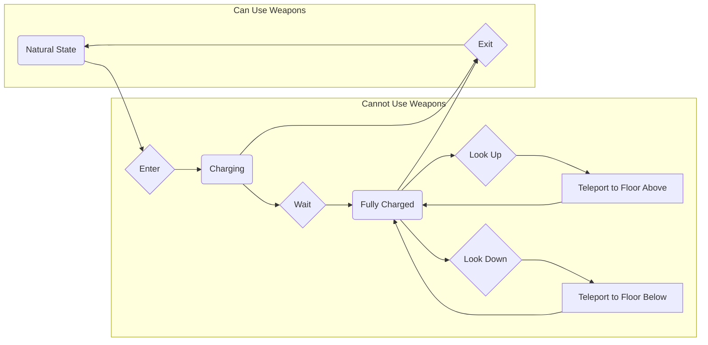

# Quantum Elevator

 

- [Quantum Elevator](#quantum-elevator)
  - [Summary](#summary)
  - [Features](#features)
  - [TODO](#todo)

## Summary

7 Days to Die modlet: A server-side elevator mod.

## Features

- TODO

## TODO

