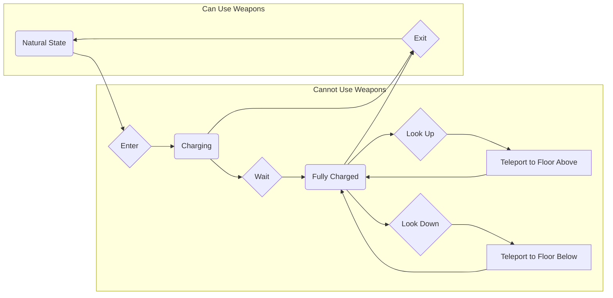

# PVP Nag Mitigation Process

This process might help to protect against rapid teleportation for pvp, but.. *is it even necessary?*

```mermaid
flowchart LR
    nat(Natural State)
    charging(Charging)
    charged(Fully Charged)
    
    above[Teleport to Floor Above]
    below[Teleport to Floor Below]

    enter{Enter}
    wait{Wait}
    up{Look Up}
    down{Look Down}
    exit{Exit}

    enter-->charging
    exit-->nat
    subgraph disable[Cannot Use Weapons]
        enter
        charging-->wait-->charged
        charged-->up-->above-->charged
        charged-->down-->below-->charged
    end

    subgraph enable[Can Use Weapons]
        exit
        nat
    end

    nat-->enter
    charging-->exit
    charged-->exit
```
